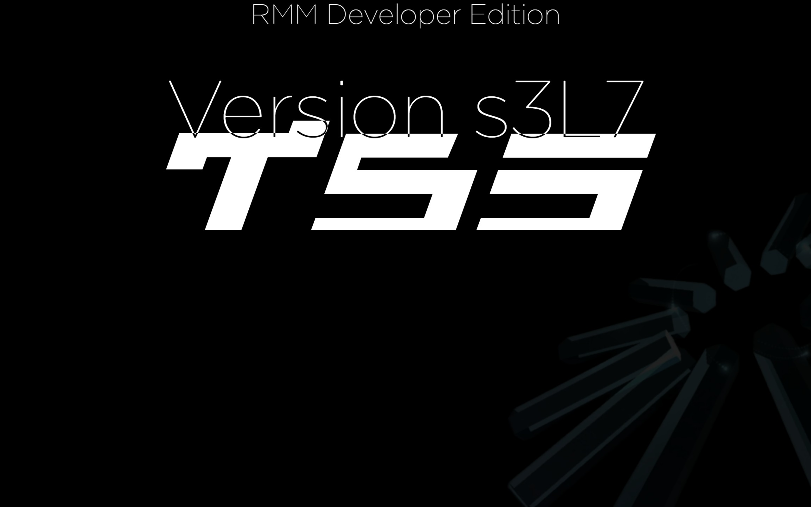

<p align="center">
  <a href="https://tysonmediagroup.org">
    
  </a>
</p>

<h1 align="center">T5S Games (2D)</h1>

<p align="center">
  <a href="https://developer.mozilla.org/en-US/docs/Web/API/Canvas_API"></a>
  <a href="https://developer.mozilla.org/en-US/docs/Web/JavaScript"></a>
  <a href="https://pages.cloudflare.com"></a>
  <a href="https://tysonmediagroup.org"></a>
</p>

2D web arcade platformer and physics sandbox for the **T5S** universe by TYSON Media Group.

<p align="center">
  
</p>

---

## Features

- **Custom 2D Physics**: Fluid movement, collision response, jumping, and momentum mechanics
- **Zero Framework Bloat**: Pure vanilla JavaScript and HTML5 Canvas API
- **Deployment Ready**: Configured for instant deployment to Cloudflare Pages (`wrangler.jsonc`)

---

## Development

Run local development server:
```bash
python3 -m http.server 8000
```
Then visit `http://localhost:8000`.
